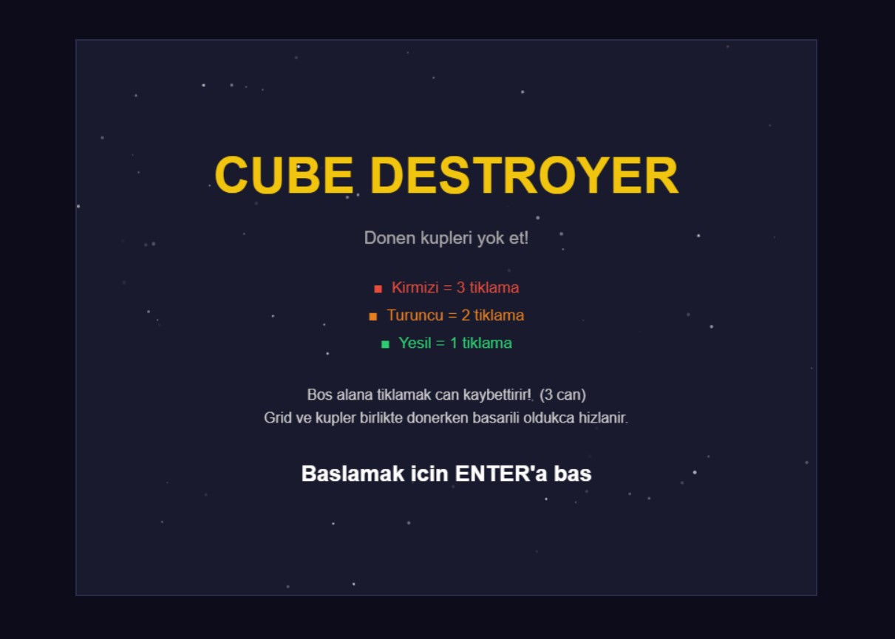
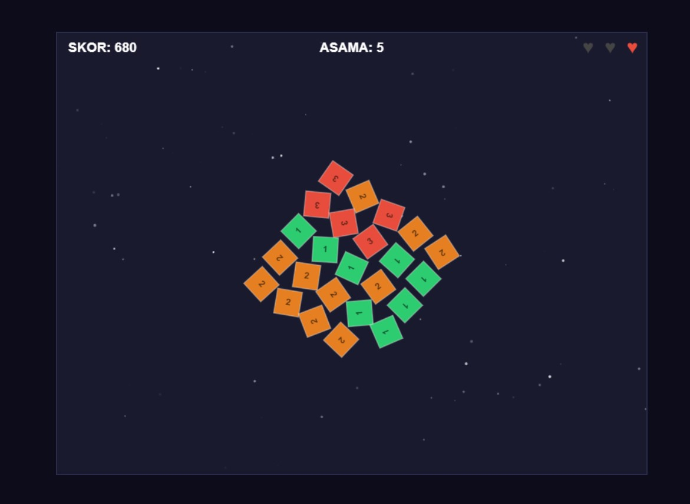

# Cube Destroyer – 2D Web Oyunu

## Oyun Mekaniklerinin Açıklaması

Bu oyunda ekranda dönen renkli küpleri fareyle tıklayarak yok etmeye çalışıyorsunuz. Her küpün bir can puanı var (1, 2 veya 3). Bu değer küpün rengi kaç tıklamayla yok olacağını gösteriyor:

- 🟥 **Kırmızı küp** → 3 tıklamayla yok olur
- 🟧 **Turuncu küp** → 2 tıklamayla yok olur
- 🟩 **Yeşil küp** → 1 tıklamayla yok olur

Bir küp yok edilince yanındaki küpler biraz büyüyor, bu da zamanla ekranı daha kalabalık hale getiriyor. Oyunda iki farklı dönüş var: küpler kendi etraflarında dönerken tüm grid de ayrıca dönüyor. Bu yüzden tıklamak giderek zorlaşıyor.(Bu özellik kendi ekledeğim orjinal oyundakinden farklı olan bir mekanik)

Her oyuncu **3 can** hakkına sahip. Boş bir yere tıklamak can kaybettiriyor. 3 can da bitince oyun bitiyor.

## Zorluğun ve Oyun Seviyelerinin Açıklaması

Oyun 6 aşamadan oluşuyor ve her aşamada zorluk artıyor:

| Aşama     | Ne Değişiyor                                                       |
| --------- | ------------------------------------------------------------------ |
| 1 → 2 → 3 | Küplerin ve gridin dönme hızı artıyor, tıklamak zorlaşıyor         |
| 4 → 5 → 6 | Dönme hızı aynı kalıyor ama küp sayısı artıyor ve küpler küçülüyor |

Yeterince küp yok ettikçe (6, 12, 18, 26, 36...) bir sonraki aşamaya geçiliyor. İlk aşamalarda sadece dönme hızı artıyor ama 4. aşamadan itibaren hem daha fazla küp geliyor hem de boyutları küçüldüğü için tıklamak çok daha zor hale geliyor.

## Kontroller

| Kontrol          | Ne Yapar                   |
| ---------------- | -------------------------- |
| **Fare Sol Tık** | Küpe tıkla, hasar ver      |
| **Enter**        | Oyunu başlat / tekrar oyna |

## Kullanılan Teknolojiler

- HTML5
- JavaScript 
- Canvas

---

## Oyun Ekran Görüntüleri

---

## Bağlantılar

|                           | Link                                               |
| ------------------------- | -------------------------------------------------- |
| 🎮 **Orijinal Oyun**      | https://lambdagamesofficial.itch.io/cube-destroyer |
| 🕹️ **Oyunun Yayın Linki** | https://ozgurrozcan.github.io/cube_destroyer/      |

---

